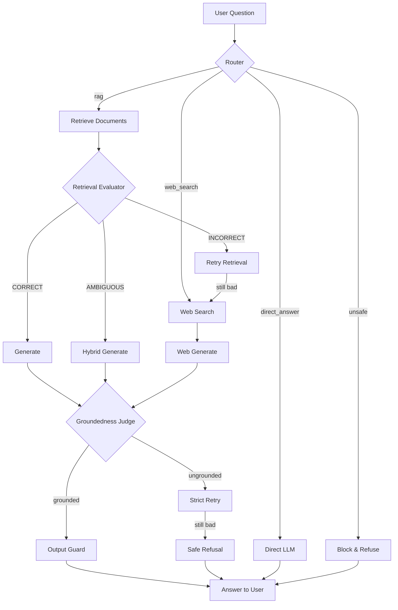

# Cortex

> **Enterprise-grade AI assistant with Corrective RAG, multi-layer guardrails, and real-time web search.**

Cortex is a full-stack, multi-agent Retrieval-Augmented Generation (RAG) application. It routes every user question to the right source — uploaded documents, live web search, or direct LLM knowledge — and verifies every answer before it reaches the user.

<p align="center">
  
  
  
  
  
</p>

---

## What Cortex Does

When you ask Cortex a question, it doesn't just call an LLM. It runs a **Corrective RAG (CRAG) workflow** that:

1. **Classifies** the question — RAG, web search, direct answer, or unsafe.
2. **Retrieves** the best document chunks from a vector store.
3. **Evaluates** retrieval quality and rewrites the query if needed.
4. **Falls back to web search** when documents aren't good enough.
5. **Generates** an answer with strict token budgets.
6. **Judges groundedness** to catch hallucinations and retry if needed.
7. **Scrubs the output** for leaked secrets and unsafe content.

The result: accurate, source-grounded, safe answers.

---

## Three Execution Paths

| Path | Use Case | Source |
|---|---|---|
| **Document RAG** | Answer from your uploaded PDFs, DOCX, TXT, and Markdown files | Supabase `pgvector` |
| **Web Search** | Live information, current events, facts outside your documents | Tavily API |
| **Direct LLM** | General knowledge, coding, math, and creative tasks | Groq LLMs |
| **Hybrid** | Combines documents and web when neither is enough alone | Both |

---

## Why Cortex Stands Out

- **Corrective RAG workflow** — retrieval evaluation, query rewriting, and web fallback baked into a LangGraph state machine.
- **Multi-layer guardrails** — prompt injection detection, PII/secrets redaction, file upload validation, indirect prompt injection scanning, and output scrubbing.
- **Groundedness judge** — an independent LLM judge verifies every answer against its context before it's returned.
- **Cloud-native embeddings** — Google Gemini `gemini-embedding-001` truncated to 768 dimensions via MRL, no local GPU required.
- **Production-minded** — rate limiting, per-node timeouts, context budgets, CORS controls, and LangSmith tracing support.
- **Evaluation framework** — built-in RAGAS-style benchmark runner to measure faithfulness, relevance, safety, and route accuracy.

---

## Architecture

```text
┌─────────────────────────────────────────────────────────────────────┐
│                          Next.js 16 Frontend                         │
│              Chat UI │ Document Upload │ Session History              │
└──────────────────────────────┬──────────────────────────────────────┘
                               │ HTTP
┌──────────────────────────────▼──────────────────────────────────────┐
│                         FastAPI Backend                              │
│   /api/chat              /api/documents/upload       /health         │
└──────────────────────────────┬──────────────────────────────────────┘
                               │
        ┌──────────────────────┼──────────────────────┐
        ▼                      ▼                      ▼
  ┌─────────────┐       ┌─────────────┐       ┌─────────────┐
  │ Guardrails  │       │ CRAG Graph  │       │ Vector Store│
  │             │       │  LangGraph  │       │  Supabase   │
  │ • Prompt    │       │             │       │  pgvector   │
  │   guard     │       │ • Router    │       │             │
  │ • PII       │       │ • Retrieve  │       └──────┬──────┘
  │   redaction │       │ • Evaluate  │                │
  │ • Rate      │       │ • Web Search│                │
  │   limiting  │       │ • Generate  │                │
  └─────────────┘       │ • Grounded  │                │
                        │   Judge     │                │
                        └──────┬──────┘                │
                               │                        │
                        Groq LLMs              Google Gemini
                        Tavily Search                Embeddings
```

---

## Tech Stack

### Backend

| Layer | Technology |
|-------|------------|
| Framework | FastAPI + Uvicorn |
| Agents | LangGraph + LangChain |
| LLMs | Groq (`ChatGroq`) |
| Embeddings | Google Gemini `gemini-embedding-001` (768-dim via MRL) |
| Vector Store | Supabase `pgvector` |
| Web Search | Tavily API |
| Document Parsing | PyMuPDF, python-docx, docx2txt, LangChain text splitters |
| Evaluation | RAGAS + custom LLM-as-a-judge metrics |
| Package Manager | `uv` (lockfile: `backend/uv.lock`) |

### Frontend

| Layer | Technology |
|-------|------------|
| Framework | Next.js 16.2.6 (App Router) |
| UI | React 19.2.4 |
| Styling | Tailwind CSS v4 |
| Icons | Lucide React |
| Package Manager | `pnpm` |

---

## Getting Started

### 1. Clone the repo

```bash
git clone https://github.com/your-username/cortex.git
cd cortex
```

### 2. Backend setup

```bash
cd backend
uv sync
```

Copy the environment file and fill in your API keys:

```bash
cp .env.example .env
```

Required keys in `backend/.env`:

```bash
GROQ_API_KEY=your_groq_api_key
TAVILY_API_KEY=your_tavily_api_key
SUPABASE_URL=https://your-project.supabase.co
SUPABASE_KEY=your_supabase_service_role_key
GEMINI_API_KEY=your_gemini_api_key
```

Optional model overrides:

```bash
GROQ_REASONING_MODEL=qwen/qwen3.6-27b
GROQ_FAST_MODEL=openai/gpt-oss-20b
```

Run the server:

```bash
uv run python main.py
```

Backend will be live at `http://localhost:8000`.

### 3. Frontend setup

In a new terminal:

```bash
cd frontend
pnpm install
```

Create `frontend/.env.local`:

```bash
NEXT_PUBLIC_API_URL=http://localhost:8000
```

Run the dev server:

```bash
pnpm dev
```

Open `http://localhost:3000` and start chatting.

---

## Running with Docker (Recommended)

You can spin up the full Cortex stack (Backend + Frontend) with Docker Compose:

### 1. Ensure `backend/.env` is configured
```bash
cp backend/.env.example backend/.env
# Edit backend/.env with your API keys (GROQ_API_KEY, TAVILY_API_KEY, SUPABASE_URL, SUPABASE_KEY, GEMINI_API_KEY)
```

### 2. Start services with Docker Compose
```bash
docker compose up --build -d
```

- **Frontend UI**: [http://localhost:3000](http://localhost:3000)
- **FastAPI API Docs**: [http://localhost:8000/docs](http://localhost:8000/docs)
- **Health Check**: [http://localhost:8000/api/health](http://localhost:8000/api/health)

### 3. Stop containers
```bash
docker compose down
```

---


## Project Structure

```text
Cortex/
├── backend/              # FastAPI + LangGraph service
│   ├── api/              # REST routers (chat, documents)
│   ├── crag/             # Corrective RAG graph, nodes, edges, state
│   ├── guardrails/       # Security & reliability controls
│   ├── rag/              # Document parsing, embeddings, vector store
│   ├── services/         # Domain logic (router, generator, judge, etc.)
│   ├── evals/            # Evaluation framework
│   ├── tests/            # pytest suite
│   ├── main.py           # FastAPI entry point
│   ├── config.py         # Central configuration
│   └── pyproject.toml    # Dependencies
├── frontend/             # Next.js 16 chat UI
│   ├── app/              # Pages & components
│   ├── package.json      # NPM dependencies
│   └── globals.css       # Tailwind theme
└── AGENTS.md             # Contributor guide for AI agents
```

---

## CRAG Workflow in Detail



---

## Testing

### Backend

```bash
cd backend
uv run pytest tests/ -q
```

Key test files:

- `test_guardrails.py` — rate limiting, prompt guard, PII, ingestion guard
- `test_api_guardrails.py` — FastAPI `TestClient` for health, chat, uploads
- `test_context_budget.py` — context budgets and web-result cleaning
- `test_crag_reliability.py` — routing, loop bounds, node timeouts
- `test_eval_framework.py` — dataset serialization and guardrail scoring

### Evaluation Benchmark

```bash
cd backend
uv run python -m evals.runner
```

Reports are saved to `backend/evals/reports/` as Markdown and CSV.

---

## API Endpoints

| Method | Endpoint | Description |
|--------|----------|-------------|
| `GET` | `/health` | Health check |
| `POST` | `/api/chat` | Send a question, get an answer |
| `POST` | `/api/documents/upload` | Upload a document (PDF, DOCX, TXT, MD) |
| `GET` | `/api/documents` | List uploaded documents |
| `DELETE` | `/api/documents/{filename}` | Delete a document |

---

## Security

Cortex implements defense in depth:

- **Secrets stay secret** — API keys live only in `.env` and `.env.local` files, which are gitignored.
- **Prompt injection defense** — regex heuristics + optional local Hugging Face classifier.
- **PII redaction** — emails, phones, SSNs, IPs, credit cards, and common API keys are masked before indexing and before downstream calls.
- **Safe file uploads** — magic-byte validation, executable payload rejection, extension/header consistency checks.
- **Indirect prompt injection** — uploaded documents are scanned and quarantined at chunk level.
- **Output scrubbing** — final answers are checked for leaked secrets, system delimiters, and unsupported citations.
- **Rate limiting** — sliding-window limits per IP + session on chat and upload endpoints.
- **CORS** — restricted to `localhost:3000` and the production Vercel URL.

---

## Deployment

- **Frontend** — built for Vercel. Configure `NEXT_PUBLIC_API_URL` to point to your backend.
- **Backend** — deploy as a container or managed Python process on port `8000`.
- **Supabase** — requires a `document_chunks` table with a `pgvector` column and the `match_document_chunks` RPC function.
- **LangGraph CLI** — graph is registered in `backend/langgraph.json` for LangGraph Platform deployments.

---

## License

MIT © [Your Name]

---

<p align="center">
  Built with FastAPI, LangGraph, Groq, Supabase, and Next.js.
</p>
